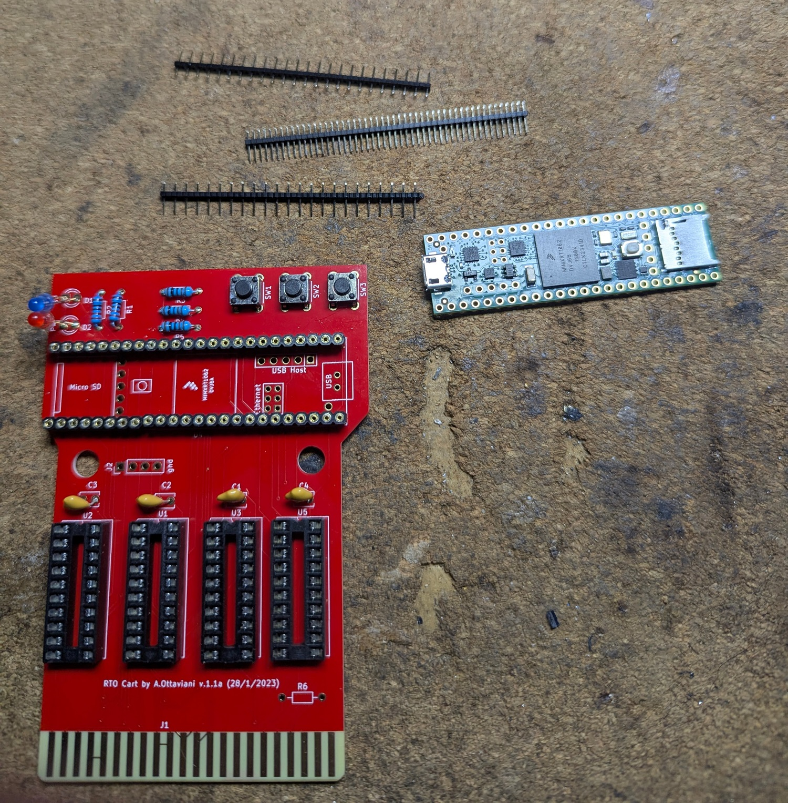
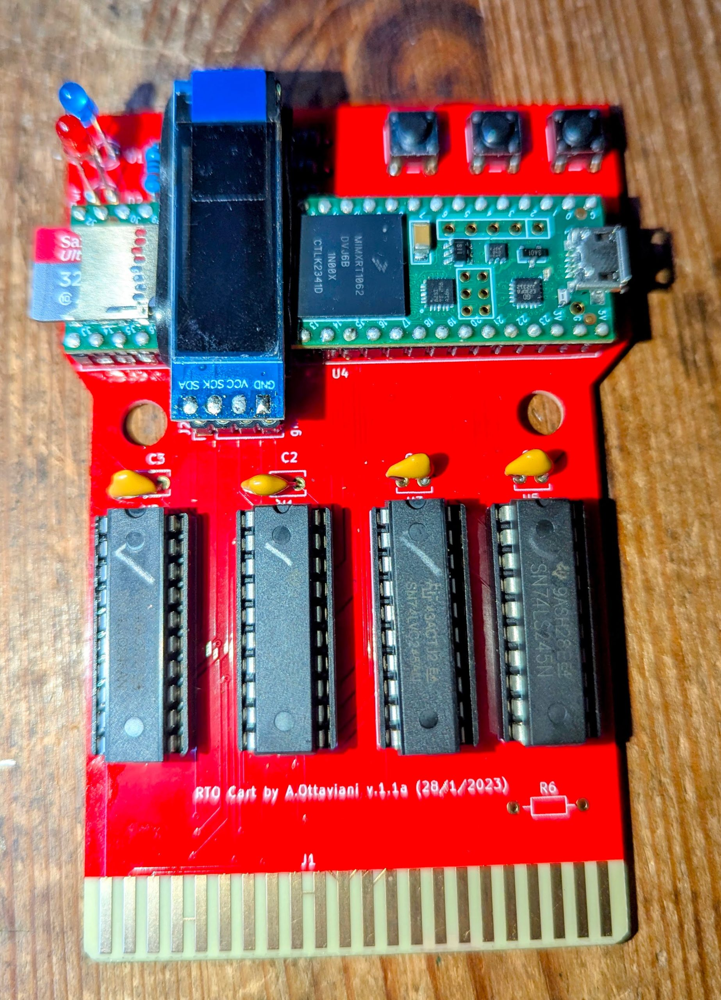

# Intellicart board assembly

This is a practical through-hole assembly and bring-up sequence for the
Intellicart PCB. It follows the construction order shown in the archived
reference build, while using the references and values from this repository's
[`project/intellicart_BOM.csv`](project/intellicart_BOM.csv). The reference
photos and setup screenshots are stored locally under
[`images/`](images/).

> Work with ESD precautions, a temperature-controlled soldering iron, and a
> current-limited USB supply where possible.  Do not insert an untested board
> into an Intellivision.

## Before soldering

1. Inspect the PCB for shorts, damaged edge contacts, or incomplete holes.
   Confirm that the cartridge-edge bevel and gold fingers, if ordered, are
   clean and undamaged.
2. Inventory the BOM and identify pin 1 on every DIP socket and IC.  Dry-fit
   the Teensy 4.1, the OLED header/display, buttons, LEDs, and the cartridge
   connector before committing solder.
3. If the Teensy or OLED may need to be removed later, use suitable machined
   headers/socket pins.  The illustrated build uses fine pins for these
   removable connections rather than permanently soldering the modules.

## Populate in height order

Install and inspect one group at a time.  Solder the shortest components
first, trim leads after each group, and check for bridges before continuing.

| Order | Fit | References / values | Notes |
| --- | --- | --- | --- |
| 1 | Resistors | R1–R2: 220 Ω; R3–R5: 1 kΩ; R6: 4.7 kΩ | Verify values before soldering. The reference build notes that R6 is not needed for normal operation; leave it fitted only if the schematic/firmware revision calls for it. |
| 2 | Decoupling capacitors | C1–C4: 100 nF | Fit close to their labelled positions. These ceramic capacitors are non-polar. |
| 3 | DIP sockets | U1, U2, U3, U5: 20-pin sockets | Align each notch with the PCB silkscreen. Solder opposite corner pins first, check that the socket is flat, then finish. Do **not** install the 74LVC245 devices yet. |
| 4 | OLED connector | J2: 1×4, 2.54 mm header/socket | Match the connector style to the OLED module and ensure its pin order agrees with the board silk/schematic. |
| 5 | Controls and indicators | SW1–SW3; D1–D2 | Buttons should sit square. Observe LED polarity: the long lead/anode must match the `+`/anode marking. |
| 6 | Cartridge interface | J1: 2×22 card-edge connector | Keep the connector exactly perpendicular to the PCB. Avoid contaminating the gold contacts with flux or solder. |
| 7 | Controller/module connections | U4: Teensy 4.1; OLED display | Fit removable headers or sockets if intended. Check all module pins are aligned before soldering. |
| 8 | Logic ICs | U1, U2, U3, U5: 74LVC245 | Only after all soldering and cleaning is complete, insert each IC into its socket with the notch/dot aligned to pin 1. |

## Inspection and electrical checks

Before connecting USB or the console:

1. Use magnification to inspect every joint, especially the Teensy headers,
   OLED header, DIP sockets, and cartridge-edge connector.
2. With a multimeter, check for a low-resistance short between the board's
   power and ground rails. Also check that adjacent edge contacts are not
   bridged.
3. Confirm each LED orientation and the pin-1 direction of every socket/IC.
4. Connect a micro-USB cable to the Teensy only. A pulsing red LED on the
   Teensy and a steady board LED are described as normal in the reference
   build; disconnect immediately if anything heats up or the supply limits.

## Program and prepare media

1. Install the Arduino IDE and the Teensy software add-on appropriate for the
   host operating system. Select the Teensy board and its USB serial port.
2. Open the RTO Cart firmware project referenced by the build article. Install
   its required `Adafruit_GFX` and `Adafruit_SSD1306` libraries, then compile
   and upload it to the Teensy. Use the firmware version that matches the
   installed board revision.
3. Format a microSD card and create `0.cfg` in its root with this default
   mapping from the illustrated guide:

   ```ini
   [mapping]
   $0000 - $1FFF = $5000 ; 8K to $5000 - $6FFF
   $2000 - $2FFF = $D000 ; 4K to $D000 - $DFFF
   $3000 - $3FFF = $F000 ; 4K to $F000 - $FFFF
   ```

4. Copy legally obtained cartridge images to the card as `.bin` files. A game
   that requires a non-default mapping needs a same-named `.cfg` file. The
   reference guide also notes that some `.int` images can be renamed `.bin`.
5. Insert the card, verify that the OLED lists the files, and test the buttons
   before the first console insertion.

## First console test

Power the console off, insert the cartridge gently and fully, then power on.
Choose a known-good small ROM from the OLED menu. If the display is blank,
buttons do not respond, or the console does not start the selected program,
power off first and recheck orientation, solder bridges, power continuity, and
the firmware/SD-card configuration.

## Illustrated reference build

The two retained photos show the PCB at the start of assembly and during
population. The rest of the photographed workflow is summarized below.

### Hardware build and test





After the pictured stages, complete the board by fitting the buttons, LEDs,
OLED connector, Teensy headers, and cartridge edge connector. Check the board
for bridges and correct orientation, then install the 74LVC245 devices in
their sockets. Connect the Teensy over USB, select the correct Teensy target
and serial port in the Arduino IDE, install the display libraries, and upload
the matching cartridge firmware. Finally, place `0.cfg` and the selected ROM
images on the microSD card, confirm that the OLED menu appears, and perform
the first console test as described above.

## Local references

- [`project/intellicart_BOM.csv`](project/intellicart_BOM.csv) — repository-specific references, quantities, and values.
- [`project/intellicart.kicad_sch`](project/intellicart.kicad_sch) — authoritative connectivity and orientation information for this PCB.
- `images/image-one.jpg` and `images/image-two.jpg` — retained reference build photos.
